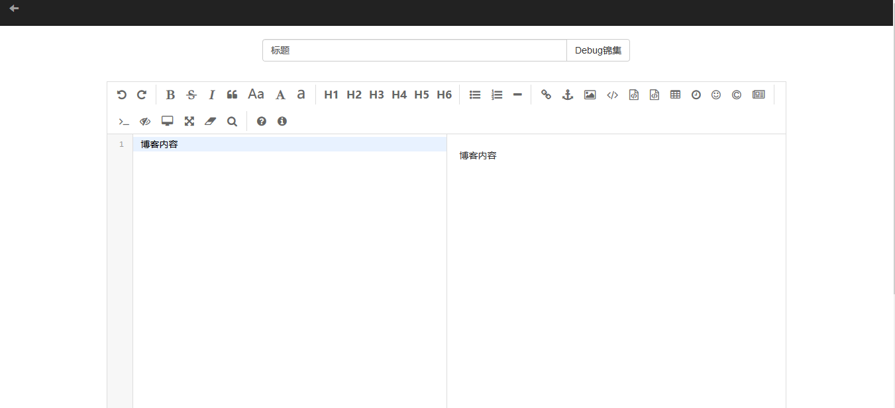
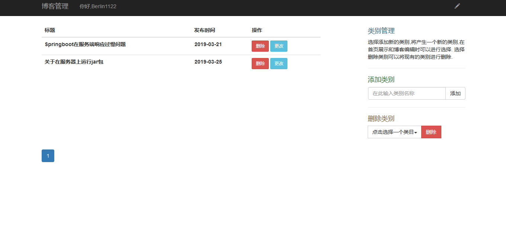
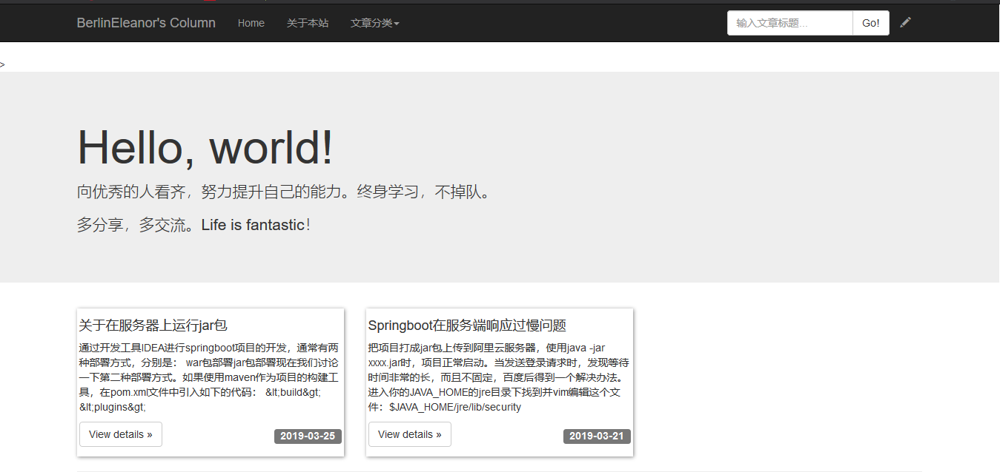
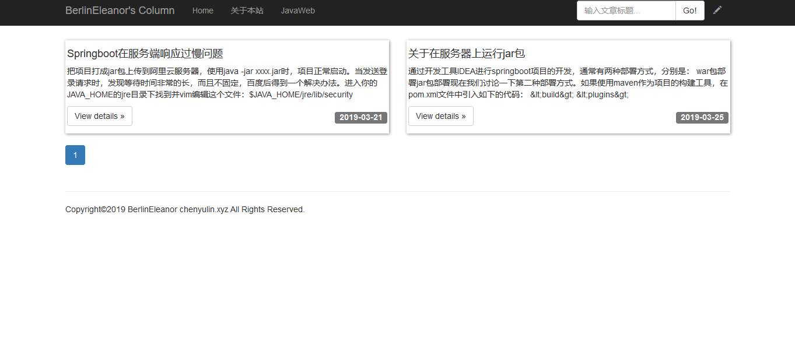
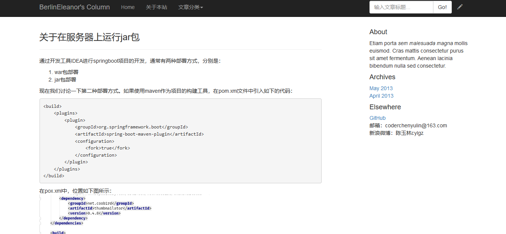

# PersonalBlog
A personal blog using SpringBoot

本项目是一个后端基于SpringBoot2.0的个人博客系统。基本功能：编辑和发表、查看、分类管理、博客删除。

#### 功能展示
1. ##### 博客编辑

2. ##### 博客管理

3. ##### 首页

4. ##### 按类别查看

5. ##### 文章详情查看

除此之外系统还包含这些基本功能：
- 分页
- 图片上传
- 图片压缩
- 模糊搜索

将于近期把整个系统从前端到后端的搭建过程详细记录下来，欢迎查看，也欢迎大家提出宝贵意见。
### contact
- coderchenyulin@163.com
### 项目地址
[chenyulin.xyz:8080/](http://chenyulin.xyz:8080/ "陈玉林专利")

### 更新
之前的版本出现一个问题，上传文件时，应用程序（准确的说是程序里内嵌的tomcat）会在云主机上创建一个临时文件夹用来做文件（图片资源）的中转站，然而，这个自动创建的文件夹的存活期限是10天，自项目部署10天后，由于这个文件夹的自动删除，导致一些相关的读写操作发生异常。最明显的体验就是首页的文章类别点击不能正常跳转。
**解决办法：**云服务器启动jar包时，在命令中指定文件中转的具体文件夹，举例，我想把临时文件夹保存到 /home/temp下面，则启动程序时应该使用这样的方式：
java -Djava.io.tmpdir=/home/temp -jar myblog.jar
